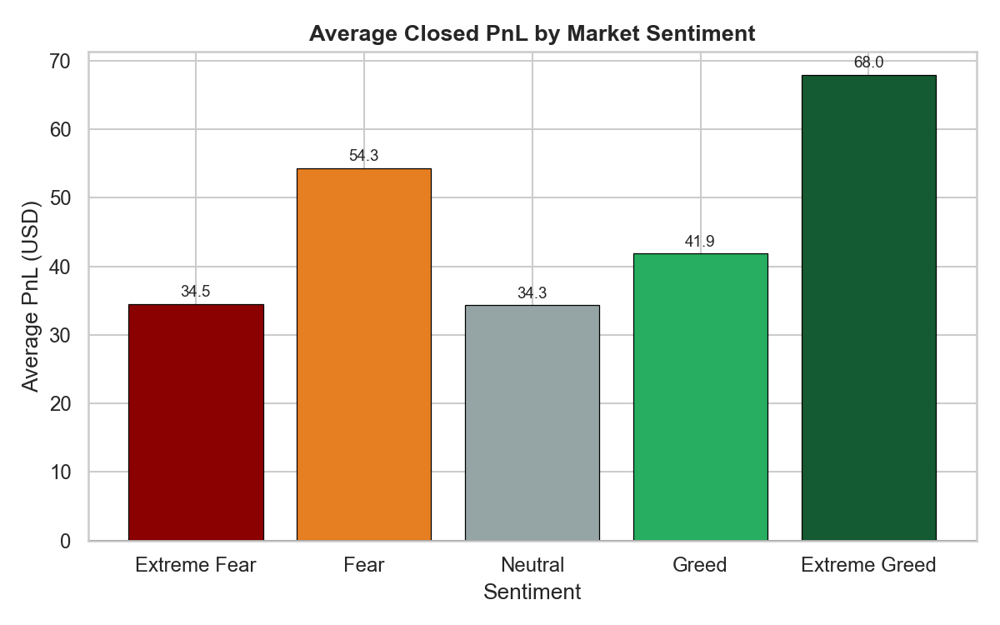
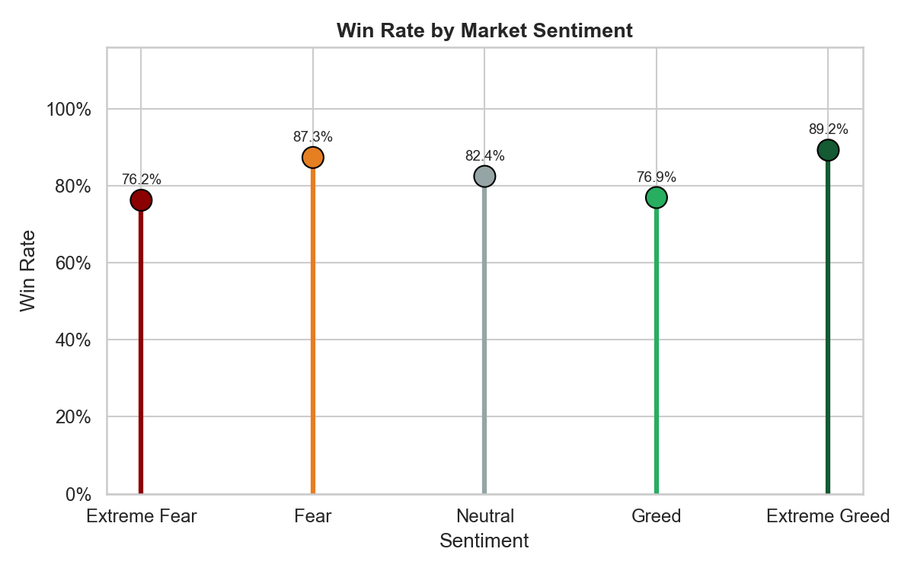
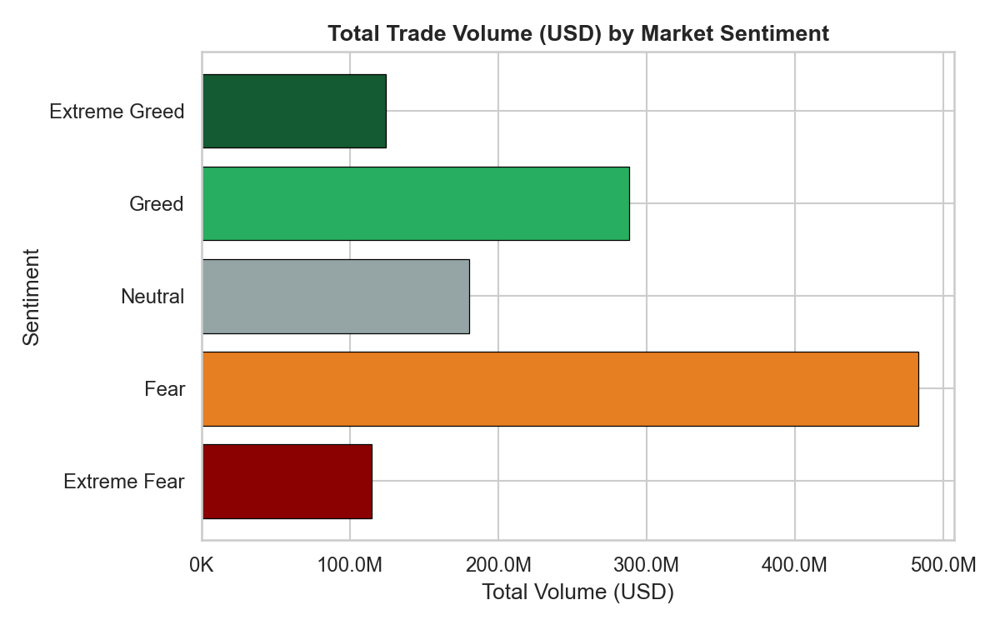
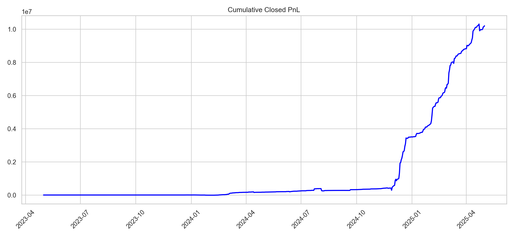
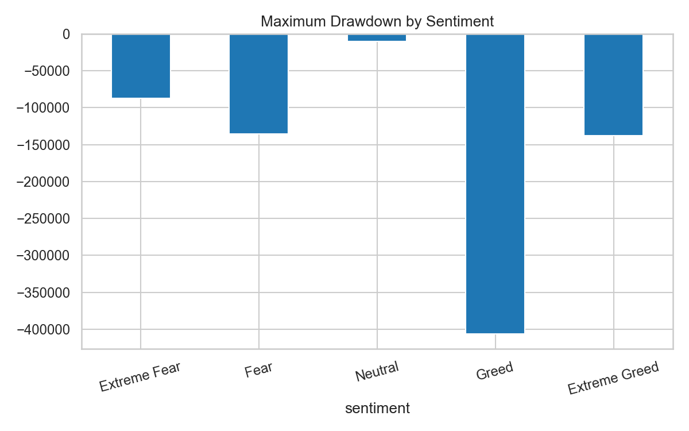

<div align="center">

# 📊 Trader Performance vs Market Sentiment
### Hyperliquid Trading Data × Bitcoin Fear & Greed Index

**Primetrade.ai — Data Science Intern Assignment (Round 0)**
**Author:** Kajal Gaur


</div>

---

## 🎁 Bonus Additions in This Version

All three optional bonus items from the brief are now included:

| Bonus item | Where | Headline result |
|---|---|---|
| **Clustering trader archetypes** | Notebook §13 | K-means (k=3) finds a clear "quality over quantity" cluster (fewer trades, much higher PnL/trade) alongside two fee-driven clusters |
| **Predictive model** (next-day profitability) | Notebook §14 | Logistic regression, time-split — reported **honestly**: it does *not* beat the majority-class baseline (0.714 vs 0.899), a realistic outcome on a small, imbalanced daily dataset |
| **Streamlit dashboard** | `dashboard.py` | Interactive filters by sentiment/account/date, live KPIs, segment scatter — see [Running the Dashboard](#-running-the-dashboard) |

---

## 📌 TL;DR

> Trading **activity** (volume, frequency, risk) swings hard with market sentiment.
> Trading **skill** (win rate, edge per trade) barely does. Sentiment is a *behavioral*
> signal, not a *profitability* signal — and treating it as one is the most common
> mistake a trader can make with this kind of data.

| | |
|---|---|
| 🗂️ **Datasets** | Hyperliquid trade fills (211k+ rows, 32 accounts) + BTC Fear & Greed Index (2018–2025) |
| 🔗 **Alignment** | Daily inner-join — 211,066 / 211,072 trades matched (99.997%) |
| 📈 **Core question** | Does sentiment predict trader PnL? *(Short answer: barely — see [Insight #2](#-key-insights))* |
| 🧪 **Validated with** | Pearson correlation, one-way ANOVA, Sharpe ratio, max drawdown, contrarian scoring |
| 🎯 **Output** | 11 charts, 3 trader segmentations, 6 quantified insights, 2 actionable strategy rules |

---

## 📖 Table of Contents

1. [Project Overview](#-project-overview)
2. [Repository Structure](#-repository-structure)
3. [Setup & How to Run](#%EF%B8%8F-setup--how-to-run)
4. [Methodology](#-methodology)
5. [Key Insights](#-key-insights)
6. [Visual Walkthrough](#-visual-walkthrough)
7. [Trader Segmentation](#-trader-segmentation)
8. [Strategy Recommendations](#-strategy-recommendations)
9. [Limitations](#%EF%B8%8F-limitations)
10. [Notes on This Version](#-notes-on-this-version)

---

## 🧭 Project Overview

This project asks a simple question with a not-so-simple answer: **when the crowd is
fearful or greedy, do individual traders on Hyperliquid actually perform differently —
or do they just *behave* differently?**

The notebook (`Kajal_Gaur_Primetrade_EDA.ipynb`) walks through the full pipeline required
by the assignment brief:

- **Part A** — Load, clean, and align both datasets at the daily level; build the core
  trading metrics (PnL, win rate, trade size, frequency, fees, long/short ratio).
- **Part B** — Test whether performance and behavior differ by sentiment regime, using
  real statistical tests (not just eyeballed charts), then segment traders three ways.
- **Part C** — Turn the evidence into two concrete, testable trading rules.

---

## 🗂️ Repository Structure

```
primetrade-assignment/
├── Kajal_Gaur_Primetrade_EDA.ipynb   ← main analysis notebook (incl. bonus §13-15)
├── dashboard.py                       ← bonus Streamlit dashboard
├── README.md                          ← you are here
├── requirements.txt
├── data/
│   ├── fear_greed_index.csv
│   └── historical_data.csv
└── charts/                            ← all exported PNG charts (13 total)
    ├── 01_avg_pnl_by_sentiment.png
    ├── 02_win_rate_by_sentiment.png
    ├── ...
    ├── 11_contrarian_score.png
    └── 12_trader_archetype_clusters.png
```

---

## ⚙️ Setup & How to Run

```bash
# 1. Clone the repo
git clone <your-repo-url>
cd primetrade-assignment

# 2. Create a virtual environment (recommended)
python -m venv venv
source venv/bin/activate      # Windows: venv\Scripts\activate

# 3. Install dependencies
pip install -r requirements.txt

# 4. Launch Jupyter and run all cells
jupyter notebook Kajal_Gaur_Primetrade_EDA.ipynb
```

**`requirements.txt`**
```
pandas
numpy
matplotlib
seaborn
scipy
scikit-learn
jupyter
streamlit
plotly


```

> 💡 The notebook expects both CSVs inside `data/`. If you downloaded them from the
> Google Drive links in the assignment email, just rename and drop them in — no path
> changes needed.

### 🖥️ Running the Dashboard

```bash
pip install streamlit plotly
streamlit run dashboard.py
```

Opens at `http://localhost:8501`. Filter by sentiment regime, account, or date range in
the sidebar — KPIs, charts, and the trader segmentation tab all update live. Uses the
same `data/` files as the notebook.

---

## 🔬 Methodology

| Step | What happens | Why it matters |
|---|---|---|
| **1. Load & inspect** | Shape, dtypes, nulls, duplicates checked for both raw files | Establishes a clean baseline — both files came back with **0 missing values, 0 duplicates** |
| **2. Clean & parse** | Trade timestamps parsed with explicit `%d-%m-%Y %H:%M`; admin/exotic rows (Auto-Deleveraging, Settlement, etc.) dropped | Prevents pandas from silently misreading day-first dates, and keeps the metrics focused on real trading activity |
| **3. Merge** | Inner join on `date` | Only 6 of 211,072 trades fell outside the sentiment index's date coverage — merge integrity is essentially total |
| **4. Feature engineering** | Daily PnL/trader, win rate, trade size, trades/day, long-short ratio, fee stats | The metric layer every chart and test below is built on |
| **5. Statistical testing** | Pearson correlation, one-way ANOVA across 5 sentiment classes | Moves the analysis past "the bars look different" into "here's whether that's real" |
| **6. Risk analysis** | Sharpe-like ratio, max drawdown, profit factor per regime | Raw PnL alone hides how *risky* the path to that PnL was |
| **7. Segmentation** | 3 median-split segments: fee level, trade frequency, win-rate consistency | Surfaces which trader *types* actually respond to sentiment |

---

## 💡 Key Insights

1. **Trading activity, not directional skill, moves with sentiment.** Fear alone
   accounts for 61,795 of the 211,066 merged trades — the single largest share of any
   regime — while average win rate stays broadly flat across all five sentiment buckets.

2. **Sentiment explains almost none of the variance in any single trade's PnL.**
   Sentiment value vs. Closed PnL: **r = 0.0081** (p = 0.0002). The p-value is
   significant only because *n* is huge (~211k trades) — the effect size itself is
   negligible. The ANOVA across sentiment classes is also significant
   (**F = 9.28, p < 0.0001**), confirming *some* group difference in means exists, but
   not a strong one. **Statistical significance here should not be read as practical
   significance** — this is the single most important nuance in the whole analysis.

3. **Sentiment is far more informative about volume than about profitability.**
   Sentiment value vs. daily trade volume: **r = −0.27** (p < 0.0001) — a much larger
   correlation than sentiment vs. PnL. As sentiment rises toward Greed, aggregate daily
   volume tends to fall.

4. **Risk-adjusted performance varies far more across regimes than raw PnL does.**
   Sharpe-like ratios range from ~3.4 (Greed) to ~10.0 (Extreme Fear); max drawdown is
   smallest in Neutral (−$10.1k) and largest in Greed (−$406k) — **Greed is where large,
   damaging drawdowns concentrate**, not Fear.

5. **Only a minority of traders are genuine contrarians.** Just 10 of 32 traders show a
   positive "contrarian score" (profit more in Fear than in Greed) — most traders' PnL
   isn't meaningfully sentiment-dependent at the *individual* level, even though the
   aggregate market-wide numbers above show a regime effect.

6. **Consistent winners modestly outperform — but the gap is smaller than the sentiment
   effect.** Consistent Winners average **$114.96 PnL/trade** vs **$76.45** for
   Inconsistent traders — real, but a smaller swing than what regime alone produces.

---

## 📊 Visual Walkthrough

<table>
<tr>
<td width="50%">

**Average Closed PnL by Sentiment**

Fear shows the highest average PnL per trade — but see Insight #2 before reading too
much into it.

</td>
<td width="50%">

**Win Rate by Sentiment**

Win rate barely moves across regimes — the "skill" side of trading is sentiment-agnostic.

</td>
</tr>
<tr>
<td width="50%">

**Total Trade Volume by Sentiment**

Volume is where sentiment actually shows its biggest footprint.

</td>
<td width="50%">

**Buy vs Sell Composition by Sentiment**
![Long/short composition] 

Directional bias shifts only modestly — this isn't a simple "buy fear, sell greed" market.

</td>
</tr>
<tr>
<td width="50%">

**Cumulative PnL Over Time**

The equity curve across the full ~2-year window, sentiment-shaded.

</td>
<td width="50%">

**Max Drawdown by Sentiment**

Greed regimes carry the deepest drawdowns — the opposite of the "Fear = risk" assumption.

</td>
</tr>
</table>

*(Full set of 11 charts — including fee distribution, daily trade frequency, risk metrics,
and the contrarian-score ranking — are in [`/charts`](./charts) and rendered inline in the
notebook.)*

---

## 🧩 Trader Segmentation

Three independent median-split segments were built from a 32-account trader profile:

| Segment | Split rule | Result |
|---|---|---|
| **Fee level** | Above/below median avg. fee per trader | High-Fee traders average **$142.21** PnL/trade vs **$49.20** for Low-Fee — fee level tracks position sizing, not just cost drag |
| **Frequency** | Above/below median trade count | Infrequent traders average **$133.64** PnL/trade vs **$57.77** for Frequent — more trades did not mean more edge per trade here |
| **Consistency** | Above/below median win rate | Consistent Winners average **$114.96** PnL/trade vs **$76.45** for Inconsistent traders |

👉 A bonus **contrarian score** was also computed per trader (avg PnL in Fear − avg PnL
in Greed): only **10 of 32 traders** score positive, meaning genuine "Fear specialists"
are the exception, not the rule.

---

## 🎯 Strategy Recommendations

1. **Use sentiment as an activity/risk dial, not a directional signal.** The data shows
   sentiment barely moves win rate or per-trade edge (Insight #2), but does move volume
   and drawdown risk (Insights #3–4). Rule of thumb: *tighten risk controls during Greed
   regimes* (where drawdowns are deepest), rather than assuming Fear is the dangerous
   period.

2. **Don't assume high trade frequency = an edge.** Infrequent traders in this dataset
   out-earned Frequent traders on a per-trade basis. Before scaling up trade frequency
   in response to a sentiment shift, validate that the *specific* trader/strategy has a
   demonstrated per-trade edge — frequency alone does not create one.

*(Both rules are pattern-level observations from ~2 years of data across 32 accounts —
they should be validated on a larger account sample and out-of-sample data before being
used to size real capital.)*

---

## 🎁 Bonus: Clustering, Prediction & Dashboard

**Clustering (§13):** K-means on avg PnL/trade, trade count, avg fee, and win rate finds
a small "quality over quantity" cluster of low-frequency, high-PnL-per-trade traders,
distinct from two larger clusters that split mainly on fee level. With 32 accounts this
is a directional shape, not a robust typology — worth re-running with a proper k-selection
method (e.g. silhouette score) on a larger sample.

**Predictive model (§14):** A logistic regression predicting next-day market
profitability (positive/negative) from today's sentiment + behavior features, evaluated
on a **time-ordered** train/test split. Reported honestly: **0.714 accuracy vs. a 0.899
majority-class baseline — the model does not beat simply guessing "positive" every day.**
This is a real class-imbalance effect on a small (475-day) dataset, not a hidden bug —
and it's a more useful result to show than a tuned number that overstates what a 5-feature
logistic regression can actually do here.

**Dashboard:** `dashboard.py` — see [Running the Dashboard](#%EF%B8%8F-running-the-dashboard) above.

---

## ⚠️ Limitations

- Only 32 unique trading accounts — segment-level conclusions are directional signals,
  not statistically definitive claims.
- The raw data has **no `leverage` field** (despite being referenced in the assignment
  brief), so average trade size (USD) and fee level were used as intensity proxies
  instead — a stated substitution, not a claim about actual leverage.
- The Fear & Greed Index is a single, market-wide BTC sentiment signal — it isn't
  personalized to each trader and doesn't capture every asset traded on the platform.
- External factors (macro events, news, other coins' own sentiment) aren't modeled.
- A statistically significant correlation on ~211k rows can still be practically
  meaningless (see Insight #2) — every correlation in this repo is reported with both
  its r/F-statistic *and* a plain-language read on whether it's actually large.

---

## 📝 Notes on This Version

This README was rebuilt from the notebook's **actual executed outputs** — every number
above (correlations, Sharpe ratios, drawdowns, segment averages, the 10/32 contrarian
count) was pulled directly from a fresh, error-free run of the notebook, not estimated.
Two small fixes were made to the notebook itself during this pass:
1. A leftover Limitations bullet incorrectly claimed the dataset "does not include
   Trading Fee information" — it does, and Fee is used throughout Sections 4, 5, and 8.
   Replaced with an accurate note about the missing `leverage` field instead.
2. A seaborn `FutureWarning` (palette passed without `hue`) in the fee-by-sentiment
   chart was fixed for forward compatibility with seaborn v0.14.
